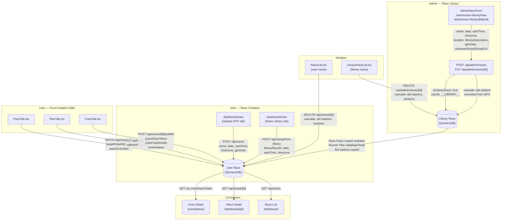

# Race Object: Data Model & Lifecycle

**Last updated:** 2026-04-20
**Status:** Current

This document is the canonical reference for the `Race` record — its fields, their classification, every place in the codebase where races are created or mutated, and how a race moves through its lifecycle.

---

## 1. Data Model

All fields on the Race record fall into one of four categories:

| Category | Meaning |
|---|---|
| **System** | Set once at creation; never modified |
| **Race Fact** | True for every runner in the race; copied verbatim when a library race is cloned |
| **Runner Plan** | Specific to one runner's execution; never copied from library; initialised fresh |
| **Library Only** | Metadata that only applies to library races; not meaningful on user races |

### Full field reference

| Field | Type | Category | Notes |
|---|---|---|---|
| `raceId` | `string` (UUID) | System | Auto-generated on create |
| `userId` | `string` | System | `__LIBRARY__` for library races |
| `createdAt` | `string` (ISO 8601) | System | Set by `createRace()` |
| `name` | `string` | Race Fact | Race display name |
| `date` | `string` (YYYY-MM-DD) | Race Fact | Canonical race date |
| `startTime` | `string` (HH:MM 24h) | Race Fact | Typical race start time |
| `timezone` | `string` (IANA) | Race Fact | e.g. `"America/Los_Angeles"` |
| `gpxData` | `string?` | Race Fact | Stored gzip+base64 compressed; decompressed on read |
| `gpxUrl` | `string?` | Race Fact | Reserved; not populated by any current code path |
| `startLat` | `number?` | Race Fact | Auto-extracted from GPX start point |
| `startLon` | `number?` | Race Fact | Auto-extracted from GPX start point |
| `location` | `string \| null?` | Race Fact | Geography string, e.g. `"Squaw Valley, CA"` |
| `rdName` | `string?` | Race Fact | Race director name |
| `rdPhone` | `string?` | Race Fact | Stored as entered; no normalisation |
| `rdEmail` | `string?` | Race Fact | Race director email |
| `raceWebsiteUrl` | `string?` | Race Fact | Official race website |
| `caloriesPerHour` | `number?` | Runner Plan | Race-level default for drop bag planning |
| `targetFinishMinutes` | `number?` | Runner Plan | Runner's estimated finish time in minutes |
| `paceOverrides` | `Record<string, string>?` | Runner Plan | Per-station arrival time overrides; keyed by station `order`, value ISO 8601 |
| `crewShareToken` | `string?` | Runner Plan | 12-byte random base64url; set on crew sheet publish |
| `crewPublishedAt` | `string?` | Runner Plan | ISO 8601 timestamp of last publish |
| `runnerName` | `string?` | Runner Plan | Cached from `session.user.name` at publish time |
| `paceMode` | `'pace' \| 'finish'?` | Runner Plan | Legacy; defined but not set by current UI |
| `paceMin` | `string?` | Runner Plan | Legacy; defined but not set by current UI |
| `paceSec` | `string?` | Runner Plan | Legacy; defined but not set by current UI |
| `finishHours` | `string?` | Runner Plan | Legacy; defined but not set by current UI |
| `finishMins` | `string?` | Runner Plan | Legacy; defined but not set by current UI |
| `isLibraryRace` | `boolean?` | Library Only | Always `true` on library races; absent on user races |
| `libraryDescription` | `string \| null?` | Library Only | Short description shown in the race picker (max 160 chars) |

---

## 2. Lifecycle Diagram



---

## 3. Creation Paths

### Path A — Admin creates a library race

**Entry point:** `/admin/race-library/new` or `/admin/race-library/[raceId]/edit`

**UI component:** `src/components/admin/AdminRaceForm.tsx`

**API route:** `POST /api/admin/races` (`src/app/api/admin/races/route.ts`)

**Fields set at creation:**

| Field | Source |
|---|---|
| `name`, `date`, `startTime`, `timezone` | Admin form inputs |
| `location`, `libraryDescription` | Admin form inputs (optional) |
| `rdName`, `rdPhone`, `rdEmail`, `raceWebsiteUrl` | Admin form inputs (optional) |
| `gpxData` | File upload; stored gzip+base64 |
| `startLat`, `startLon` | Auto-extracted from GPX track start |
| `isLibraryRace` | Hardcoded `true` |
| `userId` | Hardcoded `LIBRARY_USER_ID` (`__LIBRARY__`) |

**Cascade:** GPX is parsed and aid stations are extracted. Each station gets `crewParkingCoordsSource: 'gpx'` if waypoint coordinates are found, indicating the parking location needs admin verification.

**Edit flow:** `PUT /api/admin/races/[raceId]` accepts any Race field update plus two special bodies:
- `stationUpdates` array: patches `crewParkingCoords`, `crewParkingType`, `crewLocationNotes`, `hasCrewAccess` per station
- `gpxString`: full GPX re-ingestion — merges new stations with existing, preserving any `crewParkingCoordsSource: 'admin'` data, then replaces all stations atomically

---

### Path B — User creates a race from the library

**Entry point:** `/dashboard/new` → Race Library tab → select race → confirm date/time

**UI component:** `src/app/(app)/dashboard/new/page.tsx`

**API route:** `POST /api/races/from-library` (`src/app/api/races/from-library/route.ts`)

**Required inputs:** `libraryRaceId`, `date`, `startTime`, `timezone`

**Copy semantics:**

```
// RACE FACTS — copied verbatim from library race
name, gpxData, gpxUrl, startLat, startLon, location,
rdName, rdPhone, rdEmail, raceWebsiteUrl

// date / startTime / timezone — overridden by user's input
// (the library date is the canonical race date; the user may be in a different
//  year's edition or need to adjust for their local timezone)

// RUNNER PLAN — initialised fresh (never copied from library)
caloriesPerHour, targetFinishMinutes, paceOverrides,
crewShareToken, crewPublishedAt, runnerName,
paceMode, paceMin, paceSec, finishHours, finishMins → all undefined

// LIBRARY ONLY — not carried over
isLibraryRace, libraryDescription → absent on user race
```

**Cascade:**
1. Aid stations are copied from the library race. `crewParkingCoordsSource` is stripped (it is a library-internal field). All other fields — including `crewParkingCoords`, `crewParkingType`, `crewLocationNotes`, `hasCrewAccess` — are copied verbatim.
2. Section plans are copied with the new `raceId`.
3. On any error, the partially-created race is deleted to avoid ghost records.

---

### Path C — User creates a race from a GPX upload

**Entry point:** `/dashboard/new` → Upload GPX tab → fill in name/date/time → submit

**UI component:** `src/app/(app)/dashboard/new/page.tsx`

**API route:** `POST /api/races` (`src/app/api/races/route.ts`)

**Supports:** `multipart/form-data` (with a `gpx` file field) or JSON (with `gpx` as a string)

**Fields set at creation:**

| Field | Source |
|---|---|
| `name`, `date`, `startTime` | User form inputs (required) |
| `timezone` | User form input (defaults to `'UTC'`) |
| `gpxData` | File upload; stored gzip+base64 |
| `startLat`, `startLon` | Auto-extracted from GPX first track point |

**Cascade:** GPX is parsed and aid stations are extracted and saved. The user then visits the setup page (`/dashboard/[raceId]/setup`) to configure crew access and drop bag flags per station.

---

## 4. Mutation Points

These are all the places where a Race record can be modified after creation.

| Field(s) | Component | API Route | Trigger |
|---|---|---|---|
| Race-level fields (name, date, GPX, RD contact, etc.) | `AdminRaceForm.tsx` | `PUT /api/admin/races/[raceId]` | Admin edits library race |
| `gpxData` + aid stations (full re-ingest) | `AdminRaceForm.tsx` | `PUT /api/admin/races/[raceId]` | Admin uploads new GPX; confirms replacement dialog |
| `targetFinishMinutes`, `paceOverrides` | `src/components/PaceTab.tsx` | `PATCH /api/races/[raceId]` | User enters target finish time or adjusts per-station arrival times |
| `caloriesPerHour` | `src/components/PlanTab.tsx` | `PUT /api/races/[raceId]` | User sets calories/hour in Plan tab; debounced 600ms |
| `crewShareToken`, `crewPublishedAt`, `runnerName` | `src/components/CrewTab.tsx` | `POST /api/races/[raceId]/publish` | User clicks "Publish crew sheet" |
| (clear `crewShareToken`, `crewPublishedAt`) | `src/components/CrewTab.tsx` | `DELETE /api/races/[raceId]/publish` | User clicks "Unpublish" |

**Note:** There is no user-facing UI to edit a race's `name`, `date`, or `startTime` after creation. Users who uploaded their own GPX race cannot rename it or change its date through the current app. Only admin library races can be edited via `AdminRaceForm`.

---

## 5. Read / Display Points

| Consumer | File | Race fields used |
|---|---|---|
| Dashboard race list | `src/components/RaceList.tsx` | `name`, `date`, `startTime`, `timezone`, `crewShareToken` (to show published badge) |
| Race detail page | `src/app/(app)/dashboard/[raceId]/page.tsx` | `name`, `date`, `startTime`, `timezone`, `gpxData`, `startLat`, `startLon`, `targetFinishMinutes`, `caloriesPerHour`, `paceOverrides` |
| Aid station setup | `src/app/(app)/dashboard/[raceId]/setup/page.tsx` | `gpxData`, aid stations fetched separately |
| Crew sheet | `src/app/crew/[token]/page.tsx` | `name`, `date`, `startTime`, `timezone`, `runnerName`, `crewPublishedAt`, `gpxData`, `startLat`, `startLon`, `targetFinishMinutes`, `caloriesPerHour`, `rdName`, `rdPhone`, `rdEmail`, `raceWebsiteUrl` |
| Race Library picker | `src/app/(app)/dashboard/new/page.tsx` | `name`, `location`, `date`, `libraryDescription` |
| Admin library list | `src/app/(app)/admin/race-library/page.tsx` | `name`, `date`, `location` |
| Library race API (public) | `src/app/api/library/races/[raceId]/route.ts` | Full race + aid stations — used by the library picker to preview a race before the user confirms |

---

## 6. Deletion

| Actor | UI | API Route | Cascade |
|---|---|---|---|
| User | `src/components/RaceList.tsx` — delete button + confirm dialog | `DELETE /api/races/[raceId]` | `deleteAidStations(raceId)` + `deleteSectionPlans(raceId)` run in `Promise.all`, then race record deleted |
| Admin | `src/components/admin/LibraryRaceList.tsx` — delete button | `DELETE /api/admin/races/[raceId]` | Same cascade |

`deleteRace()` in `src/lib/db/races.ts` handles all three deletes. Callers must always go through this function — never delete the race record directly.

---

## 7. DB Layer Reference (`src/lib/db/races.ts`)

| Function | Signature | Notes |
|---|---|---|
| `createRace` | `(userId, data: Omit<Race, 'raceId' \| 'userId' \| 'createdAt'>) → Race` | Generates UUID, sets `createdAt`; compresses `gpxData` |
| `getRaceById` | `(userId, raceId) → Race \| null` | Decompresses `gpxData` on return |
| `getRacesByUser` | `(userId) → Race[]` | Returns all races for a user; decompresses `gpxData` on each |
| `getRaceByCrewToken` | `(token) → Race \| null` | Uses `CrewTokenIndex` GSI; falls back to table scan if IAM policy doesn't cover index |
| `getLibraryRaces` | `() → Race[]` | Alias for `getRacesByUser(LIBRARY_USER_ID)` |
| `updateRace` | `(userId, raceId, updates: Partial<Race>) → void` | Null/undefined values trigger DynamoDB REMOVE; `gpxData` compressed before write |
| `deleteRace` | `(userId, raceId) → void` | Cascades to aid stations and section plans |
| `getRaceActivity` | `(days, excludeUserIds?) → RaceActivityDay[]` | Analytics only; full-table scan filtered to `RACE#` SK prefix |

`LIBRARY_USER_ID` is the constant `'__LIBRARY__'` used as the `userId` for all library races.
